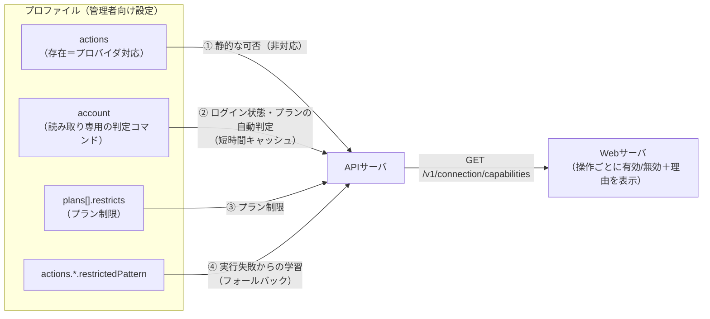
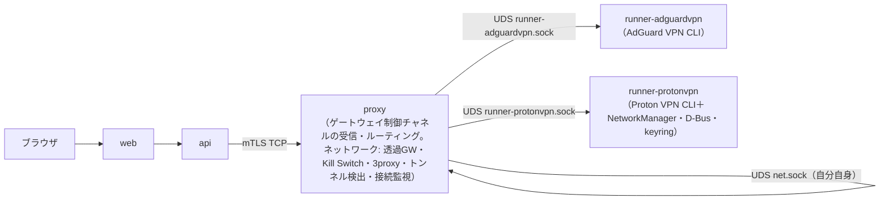
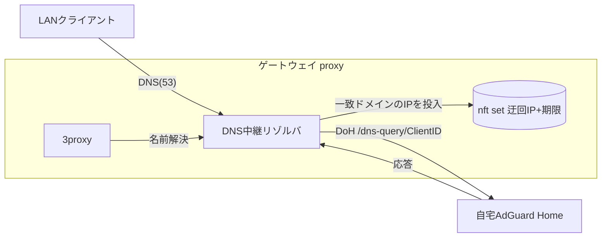

# システムの構成

システムは3つの実行単位（**ロール**）で構成する。**Webサーバ**（`web`）、**APIサーバ**（`api`）、**ゲートウェイ**（`gateway`。ホストに対するプロキシサーバ（透過ゲートウェイ・Kill Switch・明示的プロキシ）として動作する**ネットワークコンテナ（`proxy`）**と、VPNベンダーごとに用意しCLIを実行する**ランナーコンテナ（`runner-<ベンダー>`）**の組）である（Phase 8で、従来の「ベンダーごとに別のproxyコンテナ」から、ネットワーク制御とCLI実行の責務を分離した）。各ロールはdocker-composeによりサービス化する。

**ロールは、それぞれ独立したホストへ分離して配置できる（Phase 25。下記「デプロイメント構成の分離」）。** ゲートウェイ内の`proxy`・`runner-<ベンダー>`は、透過ゲートウェイ機能が`network_mode: host`を要するため常に同一ホストに同居し、分離の単位としては常に1つにまとまる。配置先はインストーラの引数（`--api`・`--web`・`--gateway`）で指定し、いずれも省略した場合は単一ホストへ全ロールをまとめて配置する（既定・最も簡単な導入経路）。

APIサーバからゲートウェイへの制御は、SSHではなく、**ゲートウェイが公開する内部専用HTTPSサーバ**（ランナーは受け取ったテキスト＝解決済みコマンドをそのまま実行するのみ。OpenAPI等の仕様を持つ正式なAPIではない）を介して行う。この経路は、ホストのネットワーク制御（nftables）・VPNベンダーCLIの実行という強い権限を行使できるため、**相互TLS（mTLS。クライアント証明書必須）**で送受信者を認証する。Phase 24までは、同一ホスト内の共有Dockerボリューム上のUnixドメインソケット（UDS）を使い、コンテナ外部からの到達をネットワーク層で物理的に遮断することで安全性を担保していたが、Phase 25でホストを分離できるようにしたため、ネットワーク到達性ではなく暗号学的な認証を境界とする方式へ改めた（詳細は`specs/proxyserver/design.md`「ゲートウェイ制御チャネル」）。ゲートウェイ内部（`proxy`⇄`runner-<ベンダー>`）は、両者が同一ホストに常在する前提が変わらないため、従来どおり共有Dockerボリューム上のUDSを使う。

ネットワークコンテナは、透過ゲートウェイモードを実現するためホストのネットワーク名前空間を共有する必要があり（詳細はSPEC-PROXY.md）、`network_mode: host` を用いる。**ランナーコンテナも、ベンダーCLIが確立するトンネルインターフェースをホスト（ゲートウェイ）のネットワーク名前空間に作らせるため、`network_mode: host`・`NET_ADMIN`・`/dev/net/tun`を用いる**。docker-composeの仕様上 `network_mode: host` と `networks:`（ユーザー定義ブリッジ）は併用できないため、これらのコンテナは他コンテナと同一のDockerブリッジネットワークには参加できない。ゲートウェイ内部（`proxy`⇄`runner-<ベンダー>`）の通信を前述のUDS方式に限定しているのはこの制約への対応でもある（`proxy`はホストのネットワーク名前空間、ランナーもそれぞれ独自にホストのネットワーク名前空間を使うため、Dockerブリッジネットワーク越しのTCPに頼れない。両者は同一ホストに同居するため、TCP化する動機もない）。

インストーラ（`curl`1コマンドで、クリーンなDebian系ベアメタルへ導入・起動する。下記「インストーラと頒布（Phase 11）」）が、ホスト（VPNゲートウェイ）に届く通信を、内部のプロキシコンテナを通して外部通信するように設定を行う。設定はコマンドではなく設定値ベースで行う。

プロキシコンテナは `restart: always` 等により永続稼働するデーモンとなるため、永続化が必要な設定（例: IPフォワーディングの有効化）はインストールスクリプトが一度だけ行い、ホスト上のファイルとして最小限の数に絞って残す。一方、VPN接続のたびに変わるトンネルインターフェース名に依存するNAT/FORWARDルールのように、静的ファイルとして表現できず実行時に変化する値は、プロキシコンテナ起動中のプロセスが動的に適用・撤去する。

## Webサーバの責務

WebサーバはGUIの表示、およびAPIのkick、実行結果のユーザ表示など、プレゼンテーション層以上の責務を持たない。

ブラウザからAPIサーバへ直接クロスオリジンでリクエストを送るのではなく、Webサーバがブラウザから見て同一オリジンで `/api/*` をAPIサーバへリバースプロキシする。これによりCORS設定が不要になるほか、Cookieベースの認証（Phase 25「認証・認可の設計方針」）をドメイン分離に起因する問題（レガシー構成での実例あり）を避けて追加できる。**Webサーバ⇄APIサーバ間がホストをまたぐ構成（Phase 25）でも、この同一オリジン構成は変えない。** Webサーバのリバースプロキシ先（`API_ORIGIN`）を任意ホストのHTTPS URLへ向けられるようにするだけで、ブラウザからは常にWebサーバの単一オリジンにのみアクセスする構成を維持する（`specs/webserver/design.md`「Web⇄API通信経路の実装」）。

## APIサーバの責務

APIサーバはWebサーバから送信されたAPI命令、および管理者向け設定（VPNクライアント操作プロファイル）とユーザ向け設定を元に、プレースホルダーに投入される値をallowlist・正規表現で検証した上でコマンド（argv配列）を解決し、**選択中のベンダー**のランナーへ、ゲートウェイの内部HTTPS（mTLS）サーバ経由でそのコマンドを送信することで、ベンダーCLIを制御することが責務である（ネットワーク設定の反映は、同じ経路でネットワークコンテナへ別途通知する）。Web UIで選択されたベンダーの保持・切替も責務とする（`specs/design.md`「ベンダーの選択と実行基盤」）。

この内部HTTPサーバとの通信経路は、テキスト（解決済みコマンド）をそのまま実行させるための内部チャネルであり、正式なAPIではないため、後述のOpenAPI定義の対象外とする。

## プロキシサーバ（ネットワークコンテナ）の責務

ネットワークコンテナ（`proxy`）は、以下2つのモードに両対応する。ベンダーCLIは実行しない（それはランナーの責務）。

- **透過ゲートウェイモード**: LAN機器がこのホストをデフォルトゲートウェイとして設定した場合に、そのフォワード通信をVPNトンネル経由でNAT/MASQUERADEし、実際にクライアントがホスト（ゲートウェイ）を介した通信にあたってVPNトンネル越しに通信できるようにする。
- **明示的プロキシモード**: ホストがSOCKS5/HTTPプロキシサーバとして利用できるようなポート解放を行い、クライアントが個別にプロキシ設定することでVPNトンネル越しに通信できるようにする。

VPNトンネルが切断された場合の挙動は、ユーザ向け設定「**Kill Switch**」で制御する。ONの場合はLAN機器の通信を遮断し（フェイルクローズ）、VPN非経由での通信を防ぐ。OFFの場合は直接インターネットに抜ける（フェイルオープン）。デフォルトはONを推奨する。

## ランナーコンテナの責務

ランナーコンテナ（`runner-<ベンダー>`。要件・設計・タスクは`runner/`）は、そのベンダーのCLIを実行する環境と、実行要求の受け口（許可リストで自ベンダーのバイナリのみ許可する内部HTTPサーバ）だけを持つ。CLIが確立するトンネルをホストのネットワーク名前空間に作るため`network_mode: host`で動くが、透過ゲートウェイ・Kill Switch・明示的プロキシには関与しない。

# プロバイダ抽象化アーキテクチャ（Phase 7・9）

プロバイダ（AdGuard VPN・Proton VPN等）ごとの機能差・プラン制限を、コードの分岐ではなく**管理者向け設定（プロファイル）のデータ**として表現する。APIサーバは「操作（オペレーション）」単位の実行可否（capability）を計算してWebサーバへ返し、Webサーバはそれに従ってUIを制限する。



- **オペレーション（操作）**: Web UIの操作単位を表す固定の語彙。`login` `logout` `connectToLocation`（接続先を指定した接続）`connectAuto`（接続先を指定しない接続）`changeLocation`（接続中の接続先変更）`disconnect` `locationList`（接続先一覧の取得）`locationFavorites` `pingMeasurement`（ping値の計測・再計測）。プロバイダが増えても語彙は変えない（プロバイダごとの差は、各オペレーションが可能か否かのデータで表す）。
- **実行不可の原因**は`unsupported`（プロバイダ非対応）・`notLoggedIn`（未ログイン）・`planRestricted`（プラン制限）の3種で、Web UIは原因に応じた理由文を表示する。
- **判定は副作用のない情報のみ**から行う。プラン判定のために有料機能を実際に実行して確かめる（例: 無料版で失敗することを確かめるために接続コマンドを試す）ことはしない。有料版では実際に接続してしまうため。プロバイダごとに用意された読み取り専用コマンド（Proton VPN: `config list`。無料版では有料機能が`Upgrade to enable`と表示される）の出力で判定する。
- 判定に失敗・不能な場合は制限しない（fail-open）。実行時にCLIが失敗した場合の出力が`restrictedPattern`に一致すれば、以後その操作を制限として学習する（`403 operation_restricted`）。
- ログイン方式は`loginMethod`（`deviceUrl`: URL提示型 / `credentials`: ユーザー名・パスワード入力型）で宣言する。

## ベンダーの選択と実行基盤（Phase 8）

Web UI利用者が、管理者の有効化したベンダーの中から使うベンダーを選ぶ（`specs/requirements.md`「VPNベンダーの選択（Web UI）」）。接続は常に1ベンダーのみ（切替式）。



`proxy`・`runner-*`はいずれも`network_mode: host`。ランナーのCLIはトンネルをホストのネットワーク名前空間に作る。APIからゲートウェイへは常にmTLS TCPの単一経路（`proxy`が窓口）で到達し、`proxy`⇄`runner-*`間は同一ホスト常在を前提に従来どおりUDSを使う（「ゲートウェイ制御チャネル」参照）。

- **責務の分離**: ネットワークコンテナ（`proxy`）は、透過ゲートウェイ・Kill Switch・明示的プロキシ・トンネル検出（`ip route get`。ベンダー非依存）・接続監視に加え、**ゲートウェイ制御チャネル（APIからのmTLS TCP接続の受信と、ランナーへのUDS転送。Phase 25）**を担い、ベンダーCLIそのものは実行しない。ランナー（`runner-<ベンダー>`。**別アプリケーションとして`runner/`に要件・設計・タスクを切り出している**）は、ベンダーCLIを実行する（許可リストの検証と`POST /exec`）だけを担い、ネットワーク制御をしない。これにより、nftables・3proxyの所有者が1つに保たれ（ベンダーごとにproxyを起動すると競合する）、ベンダーCLIごとの重い実行環境（Proton VPNのNetworkManager等）がランナーに閉じる。
- **APIサーバ**は、有効化された全ベンダーのプロファイルを読み込み、**選択中のベンダー**（永続化。既定は有効化された先頭のベンダー）のプロファイルで全ての操作を解決し、そのベンダーのランナーのUDSへ送る。ログイン状態・プランの判定キャッシュ・学習した制限・お気に入り・最後の接続先・保存した接続先は、ベンダーごとに独立に保持する。ベンダーの切替（`PUT /v1/providers/active`）は、接続中なら現在のベンダーを切断してから切り替える（確認はWeb UI）。
- **有効化**: 管理者は、インストーラの`--providers`（例 `--providers adguardvpn,protonvpn`。`install/install.sh`が`.env`の`VPN_PROVIDERS`・`COMPOSE_FILE`へ書く）で有効なベンダーを指定する。**省略時は、その時点で`vendors/`にある全ベンダー（all）を有効にする**（`specs/requirements.md`「インストール」）。APIは`VPN_PROVIDERS`を`ENABLED_PROVIDERS`として受け取り、有効なベンダーのバンドル（`vendors/<ベンダーID>/`。下記「ベンダー非依存の設計原則」）のcompose fragmentだけが`COMPOSE_FILE`に載り、そのランナーだけが起動する。ランナーが起動していない・応答しないベンダーは、選択肢には出るが「利用不可」と表示し、選択できない。
- **ランナーの許可リスト**: ランナーは、自分のベンダーのバイナリ1つだけを実行対象とする（イメージにビルド時に焼き込む`RUNNER_ALLOWED_BINARY`）。APIコンテナが侵害されても、別ベンダーのランナー経由で任意のバイナリを実行できず、許可リストによる「最後の防波堤」は従来どおり働く。
- **切替時のネットワーク**: 切断から新ベンダーへの接続までの間、トンネルは存在しない。Kill Switch ONならLAN機器の通信は遮断、OFFなら直接インターネットへ抜ける（従来の切断時と同じ。トンネル検出はベンダー非依存のため、新ベンダーに接続すればそのインターフェースへ自動的に追従する）。

| 項目 | AdGuard VPN | Proton VPN |
|---|---|---|
| バンドル | `vendors/adguardvpn/` | `vendors/protonvpn/` |
| プロファイル | `vendors/adguardvpn/profile.json` | `vendors/protonvpn/profile.json` |
| ランナーイメージ | `vendors/adguardvpn/Dockerfile`（Alpine。単体バイナリ同梱） | `vendors/protonvpn/Dockerfile`（Ubuntu。CLI・NetworkManager・D-Bus・keyringを同梱） |
| composeのサービス | `runner-adguardvpn`（`vendors/adguardvpn/compose.yml`） | `runner-protonvpn`（`vendors/protonvpn/compose.yml`） |

Proton VPN公式CLIはNetworkManager・gnome-keyring（Secret Service）に依存し、公式にはheadless非対応とされている。ランナーコンテナ内で成立するかをPoCで確認し、成立しない場合の代替（ホストへの導入＋D-Bus共有）へ切り替える前提で設計した（PoCは合格。詳細は`runner/design.md`「Proton VPN用ランナー」）。

# ベンダー非依存の設計原則（Phase 10）

要件は`requirements.md`「ベンダー非依存性」。本番のソースコード（`api/src`・`proxy/src`・`web/src`・`web/server`・`install/`・composeの本体・共通のDockerfile）は、ベンダーのID・名称・CLIの書式を持たず、ベンダーに対する分岐をしない。差はプロファイルとベンダーバンドルだけに置く。

## 抽象化の対応表（Phase 8までのベンダー固有の埋め込みの置き場所）

| 従来のベンダー固有の埋め込み | 抽象化後 |
|---|---|
| 有効なベンダーの既定値（API・composeとも`adguardvpn`） | 特定のベンダーへの既定は持たない。`VPN_PROVIDERS`（`--providers`）が無ければ、その時点の全ベンダー（all）を既定とする（Phase 17） |
| 旧形式の状態ファイルの移行先（`adguardvpn`固定） | 移行処理を廃止する（未リリースで、実機はPhase 8で移行済み） |
| 接続先の表の列名の既定（`ISO/COUNTRY/CITY/PING`） | `listLocations.table`を必須にする |
| 接続時の指定名の加工（`(Virtual)`の除去） | `listLocations.connectName`（`{ from: "city"\|"iso", stripPattern? }`）。加工はプロファイルの`stripPattern`で表す |
| 接続状態の判定語（`connected`）と接続先の既定の書式 | `output.connectedPattern`・`output.locationPattern`を、text形式で必須にする |
| ログイン方式の既定（`deviceUrl`） | `loginMethod`を必須にする |
| ログインの標準入力の書式（パスワード→2FAの順、2FAの形式） | `login.stdin`（行のテンプレート。空の行は出さない）と、プレースホルダーの`source: "secret"` |
| 静的な列挙値（`enumFrom`。`<ベンダー名>.<項目>`形式） | 廃止（Phase 5以降、どのプロファイルも使わない） |
| composeへのランナー・ボリュームの直書き、`profiles`・AdGuardだけの特例 | ベンダーバンドルのcompose fragment。全ベンダーを同じに扱う |
| `proxy/`直下のベンダー別ファイル（Dockerfile・エントリポイント・NM設定） | ベンダーバンドルへ移す |

例外的に、`loginMethod`の2方式（`deviceUrl`・`credentials`）による処理の分岐は残す。これはベンダーに対する分岐ではなく、プロファイルが宣言する機構に対する分岐である。

## ベンダーバンドル

ベンダー1つを、ディレクトリ1つ`vendors/<ベンダーID>/`で表す。IDは`^[a-z][a-z0-9]{0,31}$`。

| ファイル | 必須 | 内容 |
|---|---|---|
| `profile.json` | ○ | VPNクライアント操作プロファイル（`apiserver/design.md`）。ファイル内の`vendor`とディレクトリ名は一致させる |
| `compose.yml` | ○ | ランナーのcompose fragment。サービス名は`runner-<ベンダーID>`、ソケットは`CTL_SOCKET_PATH: /var/run/vpngw-ctl/runner-<ベンダーID>.sock`、ボリュームは、他のバンドルと重複しない名前にする（既存のログイン情報のボリュームを引き継ぐため、名前は変えない）。`profiles`は使わない。ビルドは`context: .`・`dockerfile: vendors/<ベンダーID>/Dockerfile`のようにリポジトリルート基準で書く（複数のcomposeファイルを併用したとき、相対パスは最初のファイルの位置が基準になるため） |
| `Dockerfile` | ○ | ランナーのイメージ（ベンダーCLIの導入、`RUNNER_ALLOWED_BINARY`の焼き込み。`specs/runner/design.md`） |
| `entrypoint.sh` | 任意 | ランナーのエントリポイント（machine-idの復元、NetworkManagerの起動など、そのベンダー固有の起動処理）と付属の設定ファイル |
| `install-host.sh` | 任意 | ベンダーのCLIがホスト（ベアメタル）へのアプリケーションの導入を要するときだけ置く、ホスト側の追加手順。契約は「インストーラと頒布」 |
| `samples.json` | 推奨 | 実CLIの出力サンプルと期待値（`status`・`listLocations`・`account`）。全ベンダーに同じテストで流す |

- **composeの合成**: composeの本体（`docker-compose.yml`）は`web`・`api`・`proxy`のみを持つ。有効にしたベンダーのfragmentだけを`.env`の`COMPOSE_FILE`（`docker-compose.yml:vendors/<A>/compose.yml:vendors/<B>/compose.yml`）へ並べる。無効なベンダーのランナーは定義自体がロードされないため、起動もビルドもされない。
- **APIのプロファイル読み込み**: `./vendors`を`/etc/vpngwgui/vendors:ro`へマウントし、環境変数`VENDORS_DIR`（既定`/etc/vpngwgui/vendors`）配下の`<ベンダーID>/profile.json`を読む（旧`VPN_PROFILES_DIR`は廃止）。
- **E2E用のモックベンダー**も同じ形のバンドル（`e2e/vendors/mockproton/`）にする。E2Eは、実運用のバンドルとモックのバンドルを同じ方式で合成する。
- **ネットワークコンテナ・ランナーの共通コード**（`proxy/src`）は、ベンダーの名前を持たない。ランナーは`RUNNER_ALLOWED_BINARY`だけを知る。

## 再発防止（機械的な検査）

- **中立性の検査**（`scripts/check-vendor-neutrality.mjs`。ルートの`npm test`から実行する）: 対象は、`api/src`・`proxy/src`・`web/src`・`web/server`・`api/scripts`・`install/`・`docker-compose.yml`・共通のDockerfile・共通のエントリポイントのうち、テストファイル（`*.test.*`）・生成物・依存物を除いたファイル。**コメントも検査する。** 禁止語は、`vendors/*/profile.json`の`vendor`・`displayName`・`binary`のファイル名から動的に作り、加えて`scripts/vendor-neutrality.words`（まだバンドルが無い既知のベンダー名。要件書に登場するもの）を足す。大文字小文字は区別しない。1件でも見つかれば失敗する。
- **バンドルの適合テスト**（`api/src/profile/vendor-samples.test.ts`）: `vendors/*/profile.json`をすべて読み込み検証し、`samples.json`の各ケースを、共通のパーサー・判定処理へ流して期待値と照合する。ベンダーごとの出力の知識がバンドルに閉じる。

# デプロイメント構成の分離とロール別インストール（Phase 25）

`specs/requirements.md`「デプロイメント構成の分離」「通信路の保護」を実現するための設計。

## ロールとcomposeの分割

- `web`・`api`・`gateway`（`proxy`＋有効化した`runner-<ベンダー>`）の3ロールへ、composeファイルを分割する。
  - `compose/web.yml`・`compose/api.yml`・`compose/gateway.yml`（`gateway.yml`はベンダーバンドルの`compose.yml`と従来どおり合成する）。パス（`build.context`等）はリポジトリルート基準の相対のまま、分割前の`docker-compose.yml`から変更しない。
  - ルートの`docker-compose.yml`は、サービスを定義しない薄いアンカーファイル（`services: {}`）にする。**`include:`ディレクティブは採用しない**: docker composeの`include:`は、includeされたファイル自身の相対パスを「そのファイル自身の場所」基準で解決するため（`.env`の`COMPOSE_FILE`によるファイル結合とは解決基準が異なる）、ベンダーバンドル（`vendors/<ID>/compose.yml`。リポジトリルート基準の相対パスを前提に全フェーズで実装済み）と両立できない。代わりに、`.env`の`COMPOSE_FILE`で常にこのアンカーファイルを先頭に置くことで、docker composeのproject directory（相対パスの解決基準。既定はCOMPOSE_FILE中の最初のファイルの場所）を常にリポジトリルートに固定する。
- 各ホストの`.env`の`COMPOSE_FILE`には、`docker-compose.yml`（アンカー、先頭固定）に続けて、そのホストに配置されたロールのcomposeファイルだけを並べる（ベンダーの有効化と同じ、追加ファイルの合成方式）。どのロールをどのホストへ配置するかは、下記「オーケストレーション型インストーラ」がまとめて決定する。
- `compose/api.yml`のapiサービスは、単一ホスト構成でも常にポート（既定`3000`。環境変数`API_PORT`）をホストへ公開する。単一ホスト構成ではweb→apiはDockerネットワーク内の名前解決（`api`）で届くため本来不要だが、分離構成（webが別ホスト）ではホストのアドレス経由で到達する必要があるため、常時公開に統一する（APIサーバ自身のTLS＋web側でのCA検証が実質的な境界。`proxy`の`GATEWAY_PORT`と同じ考え方）。

## オーケストレーション型インストーラ

`install/install.sh`は、**利用者が実行する1回の呼び出しだけで、web・api・gatewayの3ロールすべての配置を完結させる**（各ホストへ個別にログインしてそれぞれ`install.sh`を実行する運用は要求しない）。

### 引数によるトポロジーの指定

| 引数 | 意味 |
|---|---|
| `--api <ホスト名/IP>` | APIサーバの配置先。省略時はインストーラを実行したホスト（ローカル） |
| `--web <ホスト名/IP>` | Webサーバの配置先。省略時はローカル |
| `--gateway <ホスト名/IP>` | ゲートウェイ（プロキシサーバ・ランナー）の配置先。省略時はローカル |

- **`--api`・`--web`・`--gateway`をいずれも指定しない場合は単一ホスト構成**（全ロールをローカルへ配置）とみなす。1つでも指定すれば分離構成となり、**指定しなかったロールはインストーラを実行したホスト（ローカル）へ配置する**（例: `--gateway 192.168.x.y`だけ指定した場合、`web`・`api`はローカルへ、`gateway`だけ`192.168.x.y`へ配置する）。
- ロールを配置するリモートホストへの到達は、**インストーラを実行したユーザーと同じユーザー名でのSSH/SCPアクセスが確立済みであること**を前提とする（鍵・エージェント・`~/.ssh/config`の用意は運用者側の責任とし、インストーラはユーザー名・秘密鍵・ポートを指定する引数を持たない。ホスト別の設定が要る場合は`~/.ssh/config`側で吸収する）。SSH/SCPには`-o StrictHostKeyChecking=no`を付与し、未知のホスト鍵の確認プロンプトで停止しないようにする（新規構築インフラで`known_hosts`が空であることを前提とした割り切りであり、能動的なMITMへの耐性は持たない。自己署名証明書と同じ「新規構築を1コマンドで通す」という設計判断に合わせた）。
  - `install/install.sh`自体は`root`権限での実行を要求する（`sudo`）ため、`sudo`実行時の実効ユーザーはrootになり、鍵の探索元も`root`の`$HOME`になってしまう。これを避けるため、SSH/SCPの接続先ユーザー名・鍵の探索元とも、`sudo`を呼び出した元のユーザー（`$SUDO_USER`。`sudo`を経由しない場合は現在のユーザー）を使う（`sudo -u $SUDO_USER ssh ...`でssh/scpプロセス自体もそのユーザーとして実行する）。

### 事前検証（接続性チェック）

処理の最初に、`--api`・`--web`・`--gateway`で指定された**すべてのリモートホスト**（ローカルは対象外）へのSSH/SCP到達性を検証する。1つでも失敗した場合、**いずれのホストにも変更を加える前に**エラーで停止する（分離構成の一部だけが適用された中途半端な状態を作らない）。

### ロールごとの実行

各ロール（web・api・gateway）について、配置先がローカルなら`install/install.sh`自身の処理（下記「本体インストーラ」の処理の順序）をそのまま実行し、リモートなら次の手順を踏む。

1. **ソースの転送**: `git archive`（現在チェックアウトしているコミット）を`ssh`経由でリモートホストへ展開する（`git archive HEAD | ssh <host> 'mkdir -p <VPNGW_DIR> && tar -x -C <VPNGW_DIR>'`）。リモートホストにDocker・Node.js等の事前導入を要求しない（既存のブートストラップと同様、`install/install.sh`自体が導入する）。
2. **証明書の配布**: 下記「証明書の生成・配布」の手順で、オーケストレーターが生成した証明書一式を`scp`で配置する。
3. **リモート実行**: `ssh <host> 'cd <VPNGW_DIR> && sh install/install.sh ...'`で、そのロール1つに限定した処理（下記「本体インストーラ」の処理の順序）を実行させる。ロールを1つに限定する指定は、利用者が直接指定する引数ではなく、オーケストレーターがリモート実行時にのみ内部的に用いる（本ファイルでは公開インターフェースとして扱わない）。

### トポロジーの固定（再実行時の検証）

- 初回インストール成功時、オーケストレーター側の`.env`へ`TOPOLOGY_API_HOST`・`TOPOLOGY_WEB_HOST`・`TOPOLOGY_GATEWAY_HOST`（値は指定ホスト名、ローカルなら空）を記録する。
- **再実行時、`--api`・`--web`・`--gateway`の指定内容（省略も含む）が記録済みのトポロジーと一致しない場合、エラーを表示して何も変更せずに停止する。** 構成変更（ロールの配置先を変える）には、アンインストールしてから新しいトポロジーで再インストールする手順を要求する（トポロジー変更の自動移行は提供しない）。
- 指定内容が記録済みと一致する場合は、従来どおりの冪等な再実行（更新・ベンダー変更・修復）として扱う。

## 証明書の生成・配布

ロール間の信頼関係（ブラウザ⇄Webサーバ、Webサーバ⇄APIサーバ、APIサーバ⇄ゲートウェイ）に必要な証明書は、すべて**オーケストレーター（インストーラを実行したホスト）がローカルで生成し、`scp`で該当ホストへ配置する**。オーケストレーターは、分離構成であればいずれにせよ全ロールの配置先ホストへのSSH/SCPアクセスを持つため、各ホストが個別にCSRを作って署名を依頼し合うような分散型のペアリング手順は不要であり、単純な「ローカル生成→配布」で足りる。

| 経路 | 認証方式 | 生成する証明書 |
|---|---|---|
| ブラウザ⇄web | 片方向TLS | webの自己署名サーバ証明書（SAN=`--web`の値。省略時は検出したLAN側アドレス） |
| web⇄api | 片方向TLS（CA証明書のみ配布） | `api-ca`と、それで署名したapiのサーバ証明書（SAN=`--api`の値） |
| api⇄gateway | 相互TLS（クライアント証明書も発行） | `gateway-ca`と、それで署名した`proxy`のサーバ証明書（SAN=`--gateway`の値）、および`gateway-ca`で署名したapiのクライアント証明書 |

- オーケストレーターは、作業用ディレクトリ（`mktemp -d`で作る一時ディレクトリ。配布後に削除する）へ上記の証明書一式を生成し、各ロールの配置先（ローカルまたは`scp`先）の所定のパス（`/etc/vpngwgui/pki/`。所有者はコンテナのuser 10001:10001、ディレクトリは700）へ配置する。CA秘密鍵は配布物に含めない（配布するのはCA“証明書”と、各サーバ・クライアントの証明書・秘密鍵のみ）。
  - リモート配置は、`/etc/vpngwgui/pki/`自体がroot所有のため、`scp`（sudoを使わない一般ユーザーの操作）でいったんリモートの一時ディレクトリへ置き、`sudo`で配置先へ移す・所有者を変える・パーミッションを設定する。ディレクトリのパーミッションをread-only（700）にする操作は、ファイル単位のパーミッション変更（グロブ`*.key`・`*.crt`の展開が要る）より後に行う（先にディレクトリを700にすると、`sudo`を伴わない側のシェルがそのディレクトリを一覧できなくなり、グロブが展開できなくなるため）。グロブの展開自体も、呼び出し元の非特権シェルではなく`sudo sh -c '...'`の中（root）で行う（再実行等で配置先が既に700になっている場合の対策）。
- **単一ホスト構成**でも、TCP+mTLSへ一本化した方針（`specs/proxyserver/design.md`「ゲートウェイ制御チャネル」）に合わせ、同じ手順をSSHなしでローカルに行う（配布先が自分自身になるだけで、生成ロジックは分離構成と共通）。
- **再実行（冪等）**: 既に証明書が存在し、かつトポロジーが変わっていなければ再生成しない。トポロジーが変わっている場合は上記「トポロジーの固定」により事前に停止するため、証明書の再生成ロジックがトポロジー不整合の状態で走ることはない。
- **`--rotate-pairing`**: 既存の証明書一式を破棄し再生成・再配布する（相手ホストを作り直した場合等）。
- **既知の制約（将来課題）**: 証明書の失効・自動ローテーション、外部認証局（Let's Encrypt等）との連携、SSH到達性が無い環境（踏み台・多段SSH等）への対応は、初版のスコープ外とする。

## ゲートウェイ制御チャネル

APIサーバからゲートウェイへの制御を、Phase 24までのUDS（コンテナごとに1つ、同一ホストの共有Dockerボリューム）から、**`proxy`が単一の窓口となるmTLS TCP**へ置き換える。`proxy`がTLSを終端し、自分宛のリクエスト（設定反映・稼働状況・接続状態の再確認）はそのまま処理し、ランナー宛はUDS経由で転送する。ランナー（`runner-<ベンダー>`）は従来どおり自分のUDSだけをlistenし、ゲートウェイホストの外からは直接到達できない。

**この転換は意図的な方針変更である**: Phase 24までは「ネットワーク的にコンテナ外部から一切到達不能」（UDS）でこの経路を守っていたが、Phase 25でホストを分離できるようにしたため、その前提が保てなくなった。代わりに、到達性ではなく暗号学的な認証（mTLS）を境界とする方式へ転換した。既存の`/settings`・`/status`・`/connection-checks`・`/exec`・`/health`のリクエスト/レスポンス形状は変えない。受信口の実装（ポート・パスルーティング・TLS設定・ファイアウォール上の推奨事項）は`specs/proxyserver/design.md`「ゲートウェイ制御チャネル（Phase 25）」に記載する。

# インストーラと頒布（Phase 11）

要件は`requirements.md`「インストール」。クリーンなDebian系ベアメタルへ、1コマンドで導入・起動する。**インストーラは2層**で、利用者が実行するのは頒布される1本のブートストラップだけである。

```
GitHub Release（タグ）／CIのartifact（ブランチ）
  install.sh  ← ブートストラップ。REF・COMMIT・REPO_URLがCIで埋め込まれている
     │  curl -fsSL <URL> | sudo sh -s -- --providers adguardvpn,protonvpn
     ▼
  ① git・curl等を導入 → ② COMMITを/opt/vpngwguiへ取得（取得後にHEADがCOMMITと一致することを確認）
     ▼
  install/install.sh  ← 本体。リポジトリ内にあり、手動でcloneした場合はこれを直接実行してもよい
     ▼
  Docker（公式リポジトリ）導入 → ホストの最小限の設定 → .env → ベンダーのホスト側手順 → docker compose up
```

## ブートストラップ（`install/bootstrap.sh`。頒布物`install.sh`の雛形）

- 雛形には`@@REF@@`（タグ名またはブランチ名。表示用）・`@@COMMIT@@`（取得するコミットの完全なSHA）・`@@REPO_URL@@`が入る。CIが`install/build-bootstrap.sh <REF> <COMMIT> <REPO_URL>`で置換して`install.sh`を作る（置換漏れがあれば失敗する）。
- 動作: root確認 → `git`・`ca-certificates`が無ければ`apt-get`で導入 → 取得先（既定`/opt/vpngwgui`。環境変数`VPNGW_DIR`で変更可）へ`COMMIT`を取得（`git init`・`git fetch --depth 1 origin <COMMIT>`・`git checkout --detach`。既にある場合は同じ手順で更新する。作業ツリーに未コミットの変更があれば中止する）→ `HEAD`が`COMMIT`と一致することを確認 → `install/install.sh`へ引数をそのまま渡して実行する。
- **ブランチ・タグへの紐付け**: 頒布物は、そのCI実行時のコミットに固定される。ブランチのブートストラップは、そのブランチの最新（CI実行時点）を取得する。

## 本体インストーラ（`install/install.sh`）

既存の`install/`の4本（`setup-sysctl.sh`・`detect-lan-interface.sh`・`setup-boot-guard.sh`・`select-providers.sh`）を、この1本へ統合する（従来の各スクリプトは削除する）。POSIX `sh`で書く。**冪等**で、再実行は更新・ベンダーの変更・修復を兼ねる。

| 引数 | 意味 |
|---|---|
| `--providers <ID>[,<ID>...]` | 有効にするベンダー。`vendors/<ID>/`が無ければ失敗する。省略時は、その時点の全ベンダー（all）を有効にする（Phase 17）。gatewayロールを含まない場合は無視する |
| `--lan-iface <名前>` | LAN側インターフェース名を手動で指定する（検出できない・複数NICの場合）。gatewayロールを含む場合のみ |
| `--redetect-lan-iface` | 保存済みのLAN側インターフェース名を捨てて再検出する |
| `--web-port <ポート番号>` | Web UIを配信するホスト側のポート（既定80）。webロールの実行時のみ（Phase 19） |
| `--no-start` | 起動（`docker compose up`）をしない |
| `--api <ホスト名/IP>`（Phase 25） | APIサーバの配置先。省略時はローカル。`specs/design.md`「オーケストレーション型インストーラ」参照 |
| `--web <ホスト名/IP>`（Phase 25） | Webサーバの配置先。省略時はローカル |
| `--gateway <ホスト名/IP>`（Phase 25） | ゲートウェイ（プロキシサーバ・ランナー）の配置先。省略時はローカル |
| `--rotate-pairing`（Phase 25） | 既存の証明書一式を破棄し、再生成・再配布する |

処理の順序:

0. **トポロジーの決定・事前検証（Phase 25新設）**: `--api`・`--web`・`--gateway`からロール→ホストの対応を決定する。再実行の場合は、記録済みのトポロジー（`.env`の`TOPOLOGY_*_HOST`）と一致するか検証し、不一致ならエラーを表示して何も変更せず停止する。指定されたすべてのリモートホストへSSH/SCP到達性を検証し、1つでも失敗すれば同様に停止する（詳細は`specs/design.md`「オーケストレーション型インストーラ」）。
1. **証明書の生成・配布（Phase 25新設）**: オーケストレーターがローカルで証明書一式を生成し、各ロールの配置先（ローカル／`scp`先）へ配置する（`specs/design.md`「証明書の生成・配布」）。

以下2〜9は、ロールごとに（配置先がローカルなら直接、リモートなら`ssh`経由で）実行する。

2. **事前検査**: root、Debian系（`/etc/os-release`の`ID`・`ID_LIKE`）、systemd、CPU（Dockerの公式リポジトリが対応するamd64・arm64・armhfのうち、Debian系の対応するもの）。満たさなければ理由を示して失敗する。
3. **共通の依存**: `ca-certificates curl gnupg git iproute2 nftables`（`apt-get`。導入済みは何もしない）。**Docker**: `docker compose version`が動けば何もしない。動かなければ、`/etc/docker/daemon.json`が無い場合に`{"ip-forward-no-drop": true}`を先に作成した上で（下記）、Dockerの公式リポジトリ（`/etc/apt/keyrings/docker.asc`と`/etc/apt/sources.list.d/docker.list`）を追加し、`docker-ce docker-ce-cli containerd.io docker-buildx-plugin docker-compose-plugin`を導入する（`ID`が`ubuntu`はubuntu、`debian`・`raspbian`はdebianのリポジトリ）。
   - **`ip-forward-no-drop`が必要な理由**: Docker Engine 28以降は、IPフォワーディングを自ら有効化した際にiptables/nftablesのFORWARDチェーンの既定ポリシーを`DROP`へ変更する。本製品は独自のnftablesテーブル（`inet vpngwgui`）でLAN機器の転送を制御するため、この既定ポリシー変更があると、同じフックの別テーブル（Dockerが追加する`ip filter`テーブル）でパケットが最終的に破棄され、透過ゲートウェイ・Kill Switchのフェイルオープン（KS OFF時の直接インターネット転送）が機能しなくなる（実機で発見・修正済み）。この設定でDocker自身にFORWARD既定ポリシーを変更させないようにする。導入済みのDockerが既に`daemon.json`を持つ場合は上書きしない。
4. **ホストの設定**: gatewayロールの実行時のみ、`/etc/sysctl.d/99-vpngwgui.conf`（IPフォワーディング。**このファイルだけを`sysctl -p`で反映**する。`sysctl --system`は、無関係な他のファイルの権限エラー（コンテナ等）で失敗しうるため使わない）と、起動時のKill Switchガード（`vpngwgui-boot-guard.service`。内容は従来の`setup-boot-guard.sh`と同じ）。
5. **`.env`の作成・更新**（他の行は保持）: `LAN_IFACE`（gatewayロールの実行時のみ。`.env`に無いときだけ、デフォルトゲートウェイの逆引きで検出する。`--lan-iface`・`--redetect-lan-iface`で上書き）、`WEB_PORT`（webロールの実行時のみ。Web UIを配信するホスト側のポート。優先順は`--web-port` ＞ `.env`の既存値 ＞ 既定80。`docker-compose.yml`の`services.web.ports`が`"${WEB_PORT:-80}:8080"`で参照する。コンテナ内は常に8080固定）、`VPN_PROVIDERS`、`API_ORIGIN`（webロールの実行時のみ）、`GATEWAY_HOST`・`GATEWAY_PORT`（apiロールの実行時のみ）、`COMPOSE_FILE`（そのロールのcomposeファイルを並べる）。オーケストレーター自身の`.env`には、加えてステップ0で決定したトポロジー（`TOPOLOGY_API_HOST`等）を記録する。
6. **ベンダーの決定（Phase 17改訂）**: gatewayロールの実行時のみ。`--providers`があればそれを使う。無ければ、その時点で`vendors/`にある全ベンダー（all）を使う。対話選択は行わない（`.env`の既存の`VPN_PROVIDERS`は、引数なしの実行では参照しない。initial installでもupdateでも常に「指定 ＞ 全ベンダー」の2択に統一し、新しく`vendors/`へ追加されたベンダーが次回の`--providers`省略時の再実行で自動的に有効化されるようにする）。
7. **ベンダーのホスト側手順**: gatewayロールの実行時のみ。有効なベンダーの`install-host.sh`があれば実行する（下記の契約）。1つでも失敗したら、起動の前に中止する。
8. **起動**: `docker compose up -d --build --remove-orphans`（無効にしたベンダーのランナーは、`--remove-orphans`で停止・削除される。ログイン情報のボリュームは残す）。webロールの実行時は、Web UIが応答するまで待つ（最大約3分）。
9. **完了の表示（オーケストレーターがまとめて表示）**: 全ロールの配置先、Web UIのURL（`https://<webの配置先アドレス>:<WEB_PORT>`）、有効なベンダー、次の操作（まずWeb UIへアクセスして管理者アカウント（ユーザー名・パスワード）を設定すること、その後各ベンダーへログインすること。LAN機器のデフォルトゲートウェイの向け先）を表示する。

**`install-host.sh`の契約**（ベンダーバンドルの任意ファイル）: rootで`sh`により実行される。冪等で、非対話であること。実行時の環境変数`VPNGW_ROOT`（取得先）・`VPNGW_VENDOR_ID`が与えられ、カレントディレクトリはバンドルのディレクトリ。ホスト（ベアメタル）へ導入・設定するのはこのファイルだけで、共通インストーラはその内容を知らない。非ゼロ終了はインストールの中止を意味する。現在のバンドル（AdGuard VPN・Proton VPN）は、ホストの追加導入が不要なため、このファイルを持たない（実行環境は全てランナーのコンテナに閉じている）。

**アンインストール（`install/install.sh --uninstall [--keep-data]`。Phase 18・Phase 20）**: 通常のインストール処理は行わず、代わりにこのインストーラ自身が作成したホスト設定を後始末する。処理の順序: (1) `docker compose down --remove-orphans`（コンテナ・ネットワークの削除。既定では`--volumes`も付け、ベンダーのログイン情報も削除する。再導入時にログインを維持したい場合は`--keep-data`を指定し、ボリュームを保持する）。`docker-compose.yml`が無い、またはDockerが使えないホストでは何もしない（未導入・再実行でも安全）。 (2) 起動時のKill Switchガード（`vpngwgui-boot-guard.service`）を`disable --now`してユニットファイルを削除する。 (3) `/etc/sysctl.d/99-vpngwgui.conf`を削除し、稼働中の`net.ipv4.ip_forward`も0へ戻す。 (4) `vendors/`配下の全バンドル（有効・無効を問わない。アンインストール時点で`.env`が古い・無い場合があるため）の`uninstall-host.sh`（あるベンダーだけ）を実行する。**`uninstall-host.sh`の契約**は`install-host.sh`と同じ（環境変数・カレントディレクトリ）だが、非ゼロ終了で全体を中止せず、後始末を最後まで続ける（可能な範囲で後始末する方を優先する）。 (5) **ソース一式の取得先ディレクトリ（`REPO_ROOT`。既定`/opt/vpngwgui`）自体を`rm -rf`で削除する（Phase 20）**。実行中のスクリプト自身を含むディレクトリを削除する形になるが、Linuxでは既に開いているファイル記述子はunlink後も有効なままであるため、`sh`が最後まで読み進めて完走できる（`install/tests/run.sh`のセルフデリートの実機検証で確認）。誤って無関係なディレクトリを削除しないよう、`REPO_ROOT`が空・`/`・`install/install.sh`を含まない場合は中止する安全対策を設ける。削除の直前にカレントディレクトリを`REPO_ROOT`の外（`/tmp`）へ移す。**これにより、頒布されたブートストラップ（`curl -fsSL <頒布URL>/install.sh | sudo sh -s -- --uninstall`）だけでアンインストールが完結する**（ブートストラップが一時的にソースを取得先へ`git clone`してから本体インストーラを呼ぶため、事前にソースを取得しておく必要が無い。未導入のホストで実行した場合は、取得したソースに対して手順(1)〜(4)が実質的に何もせず、(5)で取得したソースを削除するだけになる）。**対象外（意図的に自動化しない。手動で削除する。理由: 他の用途と共有されうる）**: Docker本体・依存パッケージ、Dockerの公式リポジトリ設定（`/etc/apt/keyrings/docker.asc`・`/etc/apt/sources.list.d/docker.list`）。

**分離構成のアンインストール（Phase 25新設）**: `--uninstall`は`--api`・`--web`・`--gateway`を受け付けない（指定された場合はエラーで停止する）。アンインストールの範囲は、常にローカルの`.env`に記録されたトポロジーから決定する。

- **オーケストレーター（トポロジー記録がローカルにある。単一ホスト構成も含む）で実行した場合**: 記録済みの各ロールについて、配置先がローカルなら上記(1)〜(5)をそのまま実行する。配置先がリモートなら、同じ(1)〜(5)相当の後始末コマンドを`ssh`で送って実行させる。リモートの`rm -rf`等は、実行前に対象の存在有無で分岐しない（`docker-compose.yml`が無い場合に何もしない、といった事前分岐はローカルと同様に保つが、それ以外の削除操作自体は無条件に試みる）。**成功判定は、後始末の完了後にあるべき最終状態（例: `REPO_ROOT`が存在しないこと）を確認することで行い、削除前の状態を確認しない。** 一部のホストで後始末に失敗しても、可能な範囲で他のホストの後始末を続ける（既存の`uninstall-host.sh`と同じ「後始末は最後まで続ける」方針に合わせる）。最終的に、どのホストの後始末が成功・失敗したかを一覧表示する。
- **トポロジー記録がローカルに無い場合（このホストがオーケストレーターではない。例: ゲートウェイ役として`scp`で構成されただけのホストで直接`--uninstall`を実行した場合）**: **警告を表示し、ローカルの後始末（そのホストに実際に配置されているロール分の(1)〜(5)）のみを行う。** 他のホストへは一切アクセスしない（そのホストの認証情報・到達性を前提にできないため）。

**ホストへの変更（全て）**: 取得先ディレクトリ（既定`/opt/vpngwgui`）、`/etc/sysctl.d/99-vpngwgui.conf`、`/etc/systemd/system/vpngwgui-boot-guard.service`、Dockerの公式リポジトリ設定（上記2ファイル）とDocker・依存パッケージ、有効なベンダーの`install-host.sh`が行うもの。

**nftables.serviceとの順序**: `nftables.service`（`/etc/nftables.conf`を読み込み`flush ruleset`する）は、Debian 12では`nftables`パッケージを導入しても既定で無効だが、**Raspberry Pi OS（trixie）では既定で有効**である。有効な環境では起動時のルールが消去されうるため、起動ガードのユニットに`After=nftables.service`を付けて、その後に適用する（順序だけで、`nftables.service`が無い・無効な環境でも害はない）。利用者の設定は書き換えない。ホスト再起動後もガードがproxyの適用まで維持されることは、実機arm64ハードウェア（Debian 13）でのKill Switch実通信（フェイルクローズ・フェイルオープン）により確認済み。**既知の制約**: Raspberry Pi OSの32bit（armhf・`ID=raspbian`）、実際のRaspberry Pi機（GPIO・Pi用カーネル等）は未検証。IPv6は対象外。

## 頒布（CI）

- ワークフロー`.github/workflows/installer.yml`。**トリガー**: ブランチへのpush、`v*`タグのpush。**検査**: `sh -n`・`shellcheck`（`install/`）、`npm ci`と`npm test`（中立性の検査を含む）、ブートストラップの生成テスト（置換漏れが無いこと）。
- **ブランチ**: `install.sh`と`install.sh.sha256`を、ワークフローのartifact`installer-<ブランチ名>`（`/`は`-`にする）として保存する（Releaseは作らない）。
- **タグ**: `install.sh`と`install.sh.sha256`をGitHub Releaseへ添付する。利用者が使うURLは、最新: `https://github.com/nekono-dev/vpngateway-gui/releases/latest/download/install.sh`、版の固定: `https://github.com/nekono-dev/vpngateway-gui/releases/download/<タグ>/install.sh`。
- **信頼の範囲**: `curl | sh`はスクリプトの取得元（GitHub ReleaseのHTTPS）を信頼する方式である。ブートストラップは取得するコミットを固定し、取得後にSHAを照合するため、スクリプトとソースの食い違い（タグの付け替え等）は検出できる。`install.sh.sha256`で、ダウンロードして検証してから実行することもできる。

# 認証・認可の設計方針（Phase 25で改訂）

分離配置によりLAN外からの到達性が生じうるため、Web UI利用者の認証を導入する（`specs/requirements.md`「認証・認可」）。Web⇄API間は前述の通り同一オリジン構成のため、ドメイン分離に起因する問題を避けてセッションCookie認証を追加できる（この設計判断はPhase 1〜24から変えていない）。

利用者アカウント（ユーザー名・パスワード）は単一の管理者アカウントとし、**インストーラではなくWeb UIの初回アクセス時に利用者自身が設定する**。以後は設定画面から自由に変更できる（2026-09-22改訂: 当初案の「インストーラの引数で指定」から変更）。

- **リソース設計**: 「利用者アカウントそのもの」（`/v1/operator`）と「ブラウザのログイン状態（セッション）」（そのサブリソース`/v1/operator/session`）を別リソースとして分ける。既存の`/v1/session`（VPNベンダーへのログイン状態。`specs/apiserver/design.md`）とは別物であり、混同を避けるため命名を分けている（前者はWeb UIの利用者、後者はVPNベンダーアカウントの認証状態を表す）。
- **既知の制約**: 初回設定は、インストール直後にLAN上の誰が先にアクセスしてアカウントを作成するかで決まる（同種の自己ホスト型アプリに共通する制約）。取り合いを避けたい場合は、インストール直後に運用者自身が先にWeb UIへアクセスして設定することを運用でカバーする（READMEに明記する）。
- エンドポイント・Cookie属性・パスワードの保存方式・レート制限等の詳細は`specs/apiserver/design.md`「Web UI利用者の認証」、Web UI側の画面遷移は`specs/webserver/design.md`「利用者認証の実装方針」を参照。

# ドメイン単位の迂回とDNS中継の設計方針（Phase 14）

要求は`specs/requirements.md`「ドメイン単位の迂回（split-tunnel）とDNS中継」。IPで判定するnftables/ルーティングでドメインを扱うため、**ゲートウェイ内にDNS中継リゾルバを置き、問い合わせ名が迂回リストに一致したとき、応答のIPを期限付きのnft setへ投入する**方式とする（実装詳細は`specs/proxyserver/design.md`「ドメイン迂回とDNS中継」を一次情報とする）。



| 判断 | 内容 | 理由 |
|---|---|---|
| 中継リゾルバを自作する | `proxy`のNodeプロセス内で実装する（既製のdnsmasq等は使わない） | クライアントごとに異なるClientIDを付けて上流へ転送する必要があり、既製リゾルバの上流指定では表現できないため |
| 上流はDoH、識別はClientID | 上流（自宅AdGuard Home）へDoHで転送し、パスにクライアント識別子（ClientID）を載せる。識別子はクライアントのMAC（取得できなければIP）から生成する | AdGuard Homeの標準機能でクライアントが履歴に記録される。ゲートウェイの送信元IPを偽装する方式は、応答経路の変更をLANへ要求するため採らない。DHCPでIPが変わっても同一端末として追える |
| 迂回はfwmarkによるポリシールーティング | 一致IPの宛先をマーク付けし、実回線のデフォルトゲートウェイへ向ける | ベンダーCLIのトンネル設定（経路の書き換え）に依存せず、透過ゲートウェイ・明示的プロキシで共通の仕組みにできる |
| 上流障害時は選択式 | フェイルクローズ（応答を返さない）と、設定済み公開DNSへのフォールバックを利用者が選ぶ | フィルタ・履歴を優先するか、名前解決の継続を優先するかは運用者の判断であるため |

## 役割分担

| アプリケーション | 担当 |
|---|---|
| Webサーバ | 設定ダイアログ（DNS中継・迂回ドメイン）、稼働状況の表示（`specs/webserver/design.md`） |
| APIサーバ | 設定の検証・永続化、ゲートウェイへの反映、稼働状況の中継（`specs/apiserver/design.md`） |
| プロキシサーバ | DNS中継リゾルバ、nft set・ポリシールーティング、3proxyの名前解決先の切替、53番リダイレクト（`specs/proxyserver/design.md`） |
| ランナー | 関与しない |

# コーディングルール

Webサーバ用のAPIクライアントは、orvalのようなOpenAPIのクライアント生成ソフトウェアを用いて生成する。Webサーバは必ず生成されたクライアントを用いてAPIサーバにリクエストを送るとする。

APIサーバは Fastify + TypeBox + `@fastify/swagger` を用い、TypeBoxで定義したスキーマからリクエスト/レスポンスの検証とOpenAPI仕様を自動生成する構成とする。生成されたOpenAPI仕様をorvalがそのままWeb側のクライアント生成に利用する。

ただし、APIサーバ⇄ゲートウェイ間の内部コマンド実行チャネル（mTLS TCP経由の内部専用HTTPサーバ。`specs/proxyserver/design.md`「ゲートウェイ制御チャネル」）はこの限りではなく、OpenAPI仕様の対象外とする。

# 実装状況

本ファイルおよび各アプリケーションの`design.md`・`requirements.md`は、現時点で確定している仕様（最終形）を記載する。どの機能をいつ・どう実装し、どう検証したかは、各アプリケーションの`tasks.md`（`apiserver/tasks.md`・`proxyserver/tasks.md`・`webserver/tasks.md`・`runner/tasks.md`）に機能単位で記録する。全体の実装状況の一覧・横断的な残課題は`specs/tasks.md`を参照。

本システムは、最小構成（モックCLI・単一ネットワークによる疎通確認）から始め、実VPNベンダーCLI統合・ネットワーク基盤移行（`network_mode: host`）・透過ゲートウェイ／Kill Switch／明示的プロキシの実装・プロバイダ抽象化・ベンダー非依存化・インストーラ整備・デプロイメント構成の分離という順に、機能単位で段階的に実装してきた。各段階の判断根拠（前倒し・後回しにした理由等）のうち現在も有効なものは、関連するdesign.mdの該当節に記載している。
